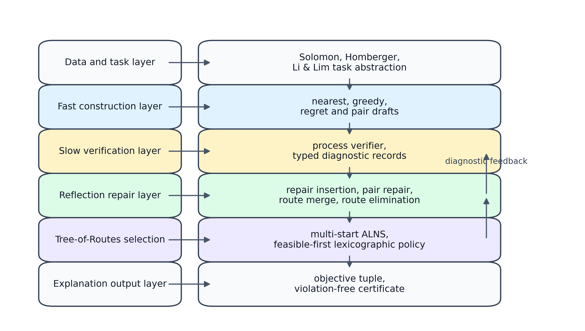
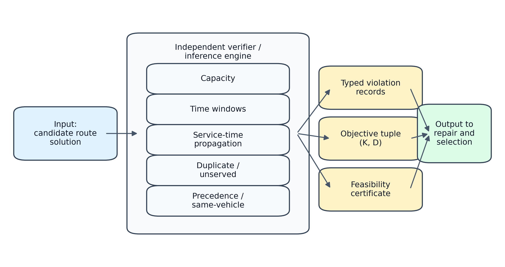
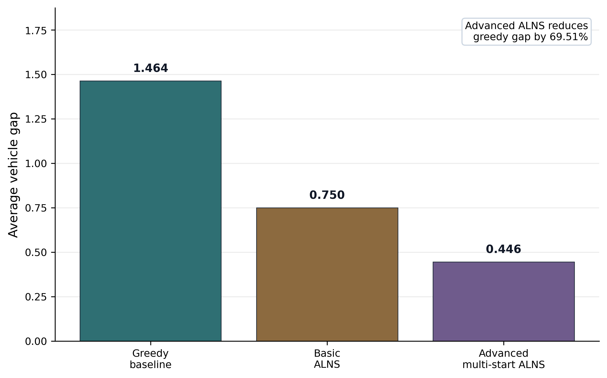
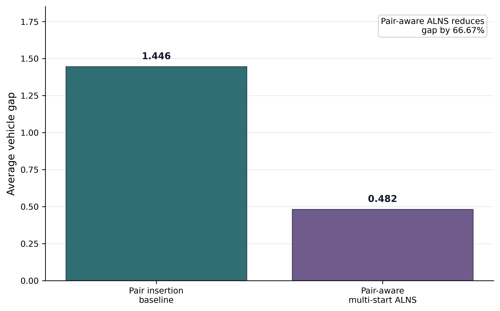
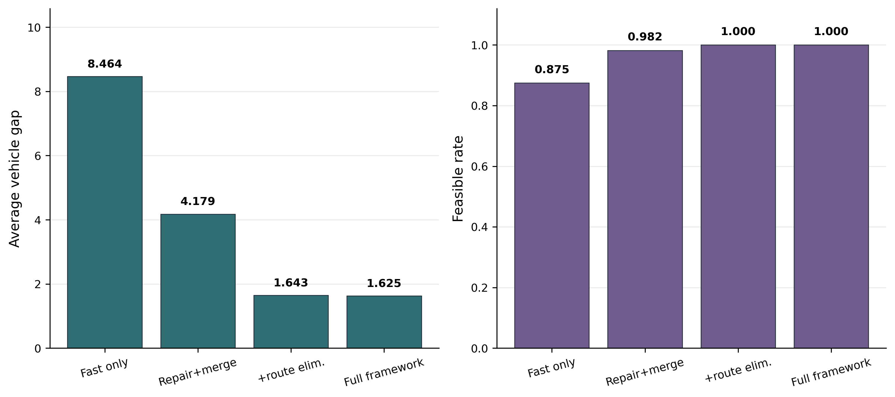

# A Knowledge-Driven Fast-Slow Decision Support Framework for Auditable Logistics Routing with Time-Window and Pickup-Delivery Constraints

## Abstract

Smart logistics routing requires route plans that remain feasible under vehicle capacity, time windows, service-time propagation, and pickup-delivery precedence constraints. This paper proposes a knowledge-driven fast-slow decision support framework for constrained logistics routing. The fast layer constructs route drafts through lightweight heuristics, while the slow layer allocates additional computation to process-level verification, typed diagnostic feedback, reflection-guided repair, route elimination, and multi-start adaptive large-neighborhood search selection. The framework is not a language-model solver; it uses deterministic routing modules and treats recent generate-verify-repair patterns only as architectural background. By externalizing feasibility verification as an interpretable diagnostic layer, the framework outputs not only feasible routes but also constraint-level decision evidence, enabling planners to audit capacity, time-window, precedence, and same-vehicle satisfaction. Experiments are conducted on public Solomon and Li & Lim benchmarks, with Homberger representative instances used only as a scalability sanity check for parsing, verification, and construction execution. On 56 Solomon 100-customer instances, the proposed advanced ALNS enhancement reduces the average vehicle gap from 1.464286 for the greedy construction baseline to 0.446429. On 56 Li & Lim 100-task instances, the pair-aware ALNS variant reduces the average vehicle gap from 1.446429 to 0.482143 while preserving same-vehicle and pickup-before-delivery constraints. The binary-versus-typed ablation shows a 1.767857 vehicle-gap reduction, and paired Wilcoxon tests confirm significant vehicle-gap reductions in the main Solomon and Li & Lim comparisons. The results show that explicit process verification and reflection-guided repair improve constructive baselines while producing auditable constraint-level evidence.

## Keywords

Vehicle routing; Time windows; Pickup-delivery; Constraint verification; Adaptive large neighborhood search; Smart logistics; Decision support

## 1. Introduction

Logistics routing is not only a shortest-path problem. A route plan must assign customers to vehicles, respect vehicle capacity, and serve each customer within a specified time interval. In pickup-delivery settings, each delivery must also remain linked to its pickup. These requirements make feasibility part of the decision itself.

The vehicle routing problem with time windows (VRPTW) has long been used to study the interaction between optimization and feasibility (Solomon, 1987). The pickup and delivery problem with time windows (PDPTW) adds paired requests, dynamic loads, precedence, and same-vehicle assignment (Ropke & Pisinger, 2006; Savelsbergh & Sol, 1995). These constraints are common in smart logistics services. They also make single construction heuristics brittle. A fast route can be cheap to compute, but it may be infeasible or difficult to repair.

Modern metaheuristics, especially adaptive large neighborhood search (ALNS), address this issue by repeatedly destroying and repairing route solutions (Liu et al., 2023; Ropke & Pisinger, 2006; Vidal et al., 2013). Recent work has also shown that feasibility checks and constraint-aware selection can improve search behaviour in routing variants (Li et al., 2024; Liu et al., 2023; Ou et al., 2024; Sun et al., 2025; Tan et al., 2023). Yet many implementations still couple construction, checking, and repair inside a single algorithm. This coupling makes it harder to diagnose why a route fails and how a repair step improves it.

Recent generate-verify-refine systems provide a useful background pattern for difficult decisions: a fast draft is followed by explicit checking, feedback, correction, and selection among candidates (DeepSeek-AI, 2025; Madaan et al., 2023; OpenAI, 2024; Snell et al., 2024; Yao et al., 2023). This paper does not use large language models to solve routing instances. The analogy is deliberately limited. The proposed contribution is a deterministic knowledge-driven routing framework that generates route drafts quickly, verifies them explicitly, diagnoses violations, repairs the route state, and selects among verified candidates.

This paper proposes a knowledge-driven fast-slow decision support framework for time-window logistics routing. Candidate route solutions are generated quickly. A process-level verifier then checks capacity, time-window, service-time, duplicate-node, unserved-node, precedence, and same-vehicle constraints at intermediate and final route states. The detected violations guide reflection-style repair and improvement. Final selection follows the benchmark objective: minimize the number of vehicles first and total distance second.

The contribution is a verifiable decision framework rather than a claim that LLMs solve VRP. The method uses standard routing and optimization components: construction heuristics, feasibility verification, repair insertion, route merge, route elimination, ALNS, and multi-start selection. Its novelty lies in how these components are organized into a knowledge-driven, process-verifiable, and auditable decision loop that is reused across VRPTW and PDPTW.

The main contributions are:

1. A fast-slow verification-guided decision architecture. The fast layer generates route drafts through lightweight construction heuristics, while the slow layer performs process-level verification, diagnostic repair, route elimination, and multi-start ALNS selection.
2. A process-level constraint verifier. The verifier acts as a lightweight inference engine and evaluates construction, repair, merge, elimination, ALNS, and final route states under capacity, time-window, service-time, precedence, same-vehicle, duplicate-node, and unserved-node constraints.
3. A reflection-guided repair mechanism. The framework maps typed violation records to targeted repair actions, including reinsertion, feasible insertion filtering, route elimination, and pair-aware repair.
4. A Tree-of-Routes multi-candidate selection process. Construction, repair, route elimination, and ALNS generate alternative route states. In the current multi-start implementation, each instance uses a candidate pool of three verified ALNS route states generated by seeds {42, 11, 23}, followed by lexicographic selection.
5. A CPU-only empirical validation on Solomon and Li & Lim benchmarks, with Homberger representative instances used only as a scalability sanity check for larger-instance execution.

The paper deliberately avoids a stronger claim that the framework is a state-of-the-art solver. The evaluation asks whether explicit verification and feedback-guided repair improve constructive baselines and whether the same pipeline transfers from VRPTW to PDPTW. This scope is important because benchmark-leading vehicle routing performance usually requires heavily tuned variant-specific solvers.

## 2. Related work

### 2.1 Time-window routing benchmarks

Classical VRPTW research established the benchmark setting used in this study. Solomon's instances remain a standard testbed for time-window routing (Solomon, 1987). They combine capacity limits, service times, travel distances, and hard service intervals. The benchmark objective is hierarchical. Vehicle count is minimized before distance. This objective is used throughout the present paper.

Pickup-delivery routing adds a paired-service structure. A request contains a pickup node and a delivery node. The two nodes must usually be served by the same vehicle, and the pickup must occur first (Savelsbergh & Sol, 1995). These constraints make PDPTW harder to handle with generic construction heuristics. A route can have a short travel distance but still be invalid if it breaks a pair, violates precedence, or creates an infeasible load sequence.

The present work uses Solomon, Homberger, and Li & Lim instances as complementary tests. Solomon evaluates standard 100-customer VRPTW behavior. Li & Lim evaluates paired pickup-delivery feasibility. Homberger representative instances test whether the same parser, verifier, and construction pipeline can run on larger VRPTW cases.

### 2.2 Destroy-and-repair search for constrained routing

ALNS is a dominant metaheuristic family for constrained routing. Ropke and Pisinger (2006) showed that adaptive removal and insertion operators can solve PDPTW effectively because different operators expose different structures in the current solution. Hybrid genetic search with adaptive diversity has also been successful across broad vehicle routing classes with time-window constraints (Vidal et al., 2013).

Recent routing studies continue to adapt ALNS to practical constraints. Efficient feasibility checks have been combined with ALNS for time-dependent green VRPTW (Liu et al., 2023). Enhanced ALNS has been applied to fatigue-conscious electric vehicle routing and scheduling (Tan et al., 2023). Improved adaptive large-neighborhood search has also been used for electric vehicle routing with soft time windows and load-dependent discharging (Sun et al., 2025). These studies share a common lesson: the useful part of ALNS is not only the destroy-and-repair loop, but also the problem-specific feasibility logic around it.

The present framework follows this line but changes the organization. Feasibility checking is not embedded as a hidden filter inside one operator. It is represented as an independent layer that all construction, repair, and ALNS stages must call. This makes violation types visible and allows the same decision pipeline to handle VRPTW and PDPTW.

### 2.3 Constraint handling in intelligent routing systems

Constraint handling is central to intelligent routing systems. Recent ESWA work on many-objective delivery and pickup routing uses constraint satisfaction information to guide evolutionary optimization (Ou et al., 2024). Deep reinforcement learning has also been applied to pickup-delivery construction, where paired node symmetry affects policy design (Li et al., 2024). These directions differ in algorithmic machinery, but they show that feasibility structure should influence search and route construction.

This paper does not train a neural policy and does not propose a new metaphor-based optimizer. It instead builds a modular decision framework around verifiable constraints. The framework uses known optimization components, but it separates their roles: construction creates drafts, verification diagnoses feasibility, repair uses feedback, ALNS improves candidates, and lexicographic selection chooses the final solution. This framing connects the method to intelligent decision-support systems rather than only to standalone route optimization.

### 2.4 Expert systems and decision-support systems for logistics routing

Expert-system-oriented routing research treats optimization as part of a broader decision process. A logistics planner must often inspect whether a candidate route satisfies operational knowledge, identify which constraint caused a rejection, and justify why one feasible route was selected over another. This differs from a pure objective-value comparison because the decision record itself becomes part of system output.

Decision-support systems for rich vehicle routing emphasize practical constraint modeling, solution inspection, and operational usability (Lacomme et al., 2021). Related ideas also appear in explainable and knowledge-guided optimization, where domain constraints are used to structure search and to make algorithmic decisions more understandable to human users. For constrained logistics routing, this means that capacity, time-window, service-time, precedence, and same-vehicle knowledge should not be hidden inside isolated operators. They should be represented in a form that can support diagnosis, repair, and final explanation.

The present study follows this decision-support perspective. It uses ALNS as an improvement engine, but the central architectural object is the verification-guided decision loop: encode routing knowledge, infer typed violations, trigger repair actions, and return a feasible route with decision evidence.

### 2.5 Process verification and self-correction as background

Recent work on iterative decision systems provides useful background for process verification and self-correction. OpenAI (2024) describes systems that allocate more computation before responding. Snell et al. (2024) analyze test-time computation and process-based verifiers. Self-Refine improves generated outputs through feedback and refinement (Madaan et al., 2023), and Tree of Thoughts generalizes single-pass generation into candidate-state search (Yao et al., 2023). DeepSeek-AI (2025) further reports self-verification and reflection behaviors under reinforcement learning.

The present paper uses this literature only to motivate an engineering pattern. It does not call a language model, train a neural verifier, or use natural-language chain-of-thought to solve routing instances. In this study, the intermediate states are explicit route solutions, the verifier applies deterministic routing constraints, and the final decision is selected by a vehicle-first objective. The central contribution is therefore a knowledge-driven verifiable decision framework for logistics routing, not a reasoning-model method.

### 2.6 Positioning of this study

The closest prior studies focus on stronger solvers for specific routing variants (Li et al., 2024; Liu et al., 2023; Ou et al., 2024; Ropke & Pisinger, 2006; Sun et al., 2025; Tan et al., 2023; Vidal et al., 2013). The present study focuses on cross-problem decision architecture. Its contribution is the integration of unified task abstraction, independent verification, route elimination, and multi-start ALNS under one reproducible CPU-only pipeline.

This positioning also defines the empirical claim. The method is not presented as a state-of-the-art BKS solver or an LLM-based route optimizer. It is presented as a knowledge-driven verification-guided decision framework that improves constructive heuristics and transfers across VRPTW and PDPTW constraints.

## 3. Methodology

### 3.1 Problem definition

A routing instance is represented by a directed or symmetric complete graph. The depot is denoted by 0. Each service node *i* has a demand *q_i*, service time *s_i*, and time window [*e_i*, *l_i*]. Each vehicle has capacity *Q*.

A solution contains a set of routes. Each route starts and ends at the depot. Let *K* be the number of non-empty routes. Let *D* be the total travel distance.

The benchmark objective is lexicographic:

minimize (*K*, *D*).

The number of vehicles is minimized first. Distance is compared second. For this reason, distance gaps are strictly comparable only when the vehicle count matches the benchmark vehicle count. The statistical tests in Section 5.8 therefore focus on vehicle gap. Distance gaps are reported as secondary descriptive evidence rather than primary paired tests because distance comparisons are meaningful only after vehicle-count equality.

For VRPTW, each route must satisfy capacity and time-window constraints:

0 <= load <= *Q*,

*e_i* <= start_i <= *l_i*,

start_j >= start_i + *s_i* + *d_ij*.

For PDPTW, each pickup *p* and delivery *d* must also satisfy:

route(*p*) = route(*d*),

position(*p*) < position(*d*).

The verifier checks these constraints after each construction or improvement stage.

### 3.2 Fast-slow verification-guided decision framework

The framework contains six functional stages: data parsing, fast candidate construction, process-level verification, reflection-guided repair and improvement, Tree-of-Routes selection, and explanation output. Figure 1 summarizes the layered decision-support architecture.

**Figure 1. Fast-slow verification-guided decision-support architecture.** Public benchmark instances enter the data layer and are converted into a unified task abstraction. The fast layer generates route drafts. The slow verification/inference layer applies routing knowledge and produces diagnostic feedback. Reflection-guided repair, route merge, route elimination, and ALNS use this feedback before Tree-of-Routes selection and explanation output.



All instances are parsed into a common task object. The object stores the depot, nodes, vehicle capacity, vehicle count, distance matrix, time windows, service times, demands, and pickup-delivery pairs. Solomon and Homberger instances use the VRPTW fields. Li & Lim instances also activate pickup-delivery pairs.

This abstraction lets the same verification and evaluation code process different benchmark families. Problem-specific logic is limited to parsing and paired insertion.

### 3.3 Fast-slow verification and process-level decision explanation

The proposed framework is organized as a knowledge-driven decision mechanism rather than as a single ALNS procedure. The fast layer produces route drafts through nearest-neighbor, greedy insertion, regret insertion, or greedy pair insertion. The slow layer spends additional computation on explicit verification, diagnostic repair, route elimination, ALNS, and multi-start selection. This separation follows the generate-verify-repair logic used throughout the framework: low-cost construction first produces route drafts, and more expensive modules then diagnose, repair, and select route states.

The knowledge base contains explicit routing rules: vehicle capacity, hard time windows, service-time propagation, pickup-before-delivery precedence, same-vehicle assignment for pickup-delivery requests, duplicate-node exclusion, unserved-node detection, and the vehicle-first benchmark objective. These rules are represented in the shared task abstraction and are activated according to problem type.

The inference engine is the process-level verifier. Given a candidate route solution, the verifier applies the knowledge base and returns a structured diagnostic result. This result includes a feasibility flag, the objective tuple (*K*, *D*), unserved nodes, and typed violation records. The diagnostic output distinguishes capacity, time-window, depot-time-window, service-time, precedence, same-vehicle, duplicate-node, unknown-node, unserved-node, and vehicle-count violations. The same verifier is called after construction, repair insertion, route merge, route elimination, ALNS, and final selection, so the decision trace records how constraint status changes through the pipeline.

The action rules connect diagnostic output to repair and improvement modules. Unserved-node and duplicate-node violations trigger repair insertion. Capacity and time-window violations constrain feasible insertion positions. In PDPTW, precedence and same-vehicle requirements activate pair insertion, where pickup and delivery must be inserted into the same route in the correct order. Route merge is used when a route can be absorbed without introducing violations. Route elimination is used when the system attempts to remove a weak or short route and redistribute its nodes through feasible insertion. ALNS then explores destroy-and-repair moves, but final acceptance and selection remain tied to verifier output.

The diagnostic action rules are:

- Duplicate-node or unknown-node violations remove invalid occurrences and reinsert required nodes if needed, restoring service consistency.
- Unserved-node violations trigger feasible insertion or open a new route, restoring full customer coverage.
- Capacity or time-window violations restrict insertion candidates to verifier-feasible positions, preventing infeasible repair moves.
- Precedence or same-vehicle violations activate pair-aware repair and same-route pickup-delivery insertion, preserving PDPTW request structure.
- Vehicle-count violations invoke route merge or route elimination, reducing vehicle count under the benchmark objective.
- Zero active violations issue a violation-free certificate and pass the candidate to selection, supporting auditable final decisions.

The decision evidence returned to a planner is therefore richer than a route list. It consists of the selected feasible route set, a violation-free certificate from the verifier, the objective tuple (*K*, *D*), and the route-repair record. This evidence explains why a candidate is accepted, why an infeasible candidate is rejected, and why the final selector prioritizes fewer vehicles over shorter distance when the two objectives conflict.

This mechanism is important for smart logistics planning. A human planner needs to know not only which route is shorter, but also why it is operationally feasible, which constraints were checked, why a route was excluded, and whether a repair stage corrected a specific violation type. The proposed architecture therefore treats verification and explanation as first-class decision functions.

### 3.4 Framework algorithm

The full decision pipeline is written at the framework level in Algorithm 1. Individual construction or ALNS operators can be replaced without changing the verification interface.

**Algorithm 1. Fast-slow verification-guided routing framework**

```text
Input:
    benchmark instance I
    construction method set G
    seed set S = {42, 11, 23}
    objective order: feasibility, vehicles, distance, violations
Output:
    selected solution x*

1. T <- parse_instance(I)
2. C <- empty Tree-of-Routes candidate set
3. for each construction method g in G do
4.     x0 <- construct_candidate(T, g)
5.     r0 <- verify_solution(T, x0)
6.     x1 <- repair_insertion(T, x0, r0)
7.     x2 <- route_merge(T, x1)
8.     x3 <- route_elimination(T, x2)
9.     add x3 to C
10. end for
11. for each candidate x in C do
12.     for each seed s in S do
13.         y <- ALNS_or_pair_ALNS(T, x, s)
14.         y <- route_elimination(T, y)
15.         ry <- verify_solution(T, y)
16.         add (y, ry, s) to C
17.     end for
18. end for
19. x* <- argmin C by (infeasible flag, vehicle count, distance, violation count)
20. return x*
```

The final ordering is strict. An infeasible solution cannot be selected over a feasible one. A solution with fewer vehicles is preferred before distance is considered. This matches the benchmark objective.

### 3.5 Candidate construction

The framework starts with construction heuristics. The VRPTW experiments use nearest neighbor, greedy insertion, and regret insertion. The PDPTW experiments use greedy pair insertion.

These methods are not treated as final solvers. They create candidate route drafts. Each draft is then checked, repaired, and improved.

### 3.6 Process-level verification

The verifier returns a structured result. It includes feasibility, total distance, vehicle count, and violation records. Violation types include capacity, time-window, service-time propagation, duplicate nodes, unserved nodes, precedence, and same-vehicle assignment.

This design prevents infeasible solutions from being silently accepted. It also creates a common feedback interface for construction, repair, route merge, route elimination, ALNS, and final selection. The verification procedure is summarized in Algorithm 2.

**Algorithm 2. Route feasibility verification**

```text
Input:
    task T
    route solution x
Output:
    verification result r

1. initialize violation list V
2. initialize visited-node set A
3. for each route R in x do
4.     load <- 0
5.     time <- depot start time
6.     for each node i in R do
7.         if i has already appeared in A then
8.             add duplicate-node violation to V
9.         end if
10.        update load with demand q_i
11.        if load < 0 or load > Q then
12.            add capacity violation to V
13.        end if
14.        update arrival and service start time
15.        if service start violates [e_i, l_i] then
16.            add time-window violation to V
17.        end if
18.        add i to A
19.    end for
20. end for
21. check unserved required nodes
22. if pickup-delivery pairs exist then
23.     check same-vehicle constraints
24.     check pickup-before-delivery constraints
25. end if
26. compute total distance and vehicle count
27. return feasibility flag, objective values, and V
```

**Figure 2. Verifier input-output mechanism.** The verifier receives a candidate route solution, checks capacity, time windows, service-time propagation, duplicate and unserved nodes, precedence, and same-vehicle constraints, and returns typed violation records, the objective tuple, and a feasibility certificate for repair and selection.



### 3.7 Reflection-guided repair and route elimination

Repair insertion handles unserved or displaced nodes by reinserting them into feasible positions. Route merge attempts to reduce the route count by moving nodes from one route into another. Route elimination targets source routes and redistributes their nodes across feasible target routes.

The repair mechanism is reflection-guided in the operational sense that a typed diagnostic record determines the next correction action. For example, duplicate and unserved records lead to reinsertion, vehicle-count records lead to merge or elimination attempts, and PDPTW pair violations lead to pair-aware insertion. Intermediate candidates may temporarily exceed the vehicle-count target during search. They must pass final verification before they can be selected.

### 3.8 Tree-of-Routes multi-start ALNS

The advanced ALNS module uses random removal, worst removal, related removal, and route removal. Repair uses greedy and regret-based insertion. Operator weights are updated adaptively. Simulated-annealing acceptance allows non-improving feasible moves during search.

Each construction draft, repair state, route-elimination state, and ALNS output is treated as a route state in a compact Tree-of-Routes decision process. The term is used as an engineering description of multi-candidate route search, not as a claim that the method performs natural-language reasoning. In the current multi-start experiments, each instance is run with the fixed seed pool {42, 11, 23}, so the final ALNS-level candidate pool contains three verifier-checked route states per instance. The final candidate is selected by the following key:

1. feasible solutions before infeasible solutions;
2. fewer vehicles;
3. shorter distance;
4. fewer violations.

This rule keeps the experiment deterministic. It also avoids selecting a shorter route that uses more vehicles. Algorithm 3 gives the multi-start selection logic.

**Algorithm 3. Multi-start ALNS selection**

```text
Input:
    task T
    base solution x
    seed set S
Output:
    best solution y*

1. B <- empty candidate set
2. for each seed s in S do
3.     y_s <- run_ALNS(T, x, s)
4.     y_s <- route_elimination(T, y_s)
5.     r_s <- verify_solution(T, y_s)
6.     add (y_s, r_s, s) to B
7. end for
8. y* <- argmin B by (infeasible flag, vehicle count, distance, violation count)
9. return y*
```

### 3.9 Distinction from conventional ALNS

The proposed framework differs from a conventional ALNS pipeline in three structural ways.

The fast-slow and Tree-of-Routes terms are operational rather than metaphorical. Each term corresponds to an implemented module, a recorded route state, or a measurable selection rule:

- The fast-slow decision process means that lightweight construction generates drafts before slower verification, repair, route elimination, and ALNS improvement consume additional CPU time. The recorded evidence is stage runtimes, route states, and final objective tuples.
- The process-level verifier means that the same verification interface evaluates construction, repair, merge, elimination, ALNS, and final route states. The recorded evidence is feasibility flags, typed violation records, and violation-free certificates.
- Reflection-guided repair means that diagnostic types determine repair actions instead of using a purely distance-driven repair rule. The recorded evidence is the violation-to-action mapping in Section 3.3 and the R101 trace in Table 10.
- Tree-of-Routes selection means that construction, repair, elimination, and multiple ALNS seeds generate a candidate set of route states. The recorded evidence is the candidate pool in Algorithm 1 and lexicographic feasible-first selection.
- Auditable decision output means that the final route is returned with objective values and an explicit verifier result. The recorded evidence is the final certificate and process trace in Table 10.

First, verification is externalized. In many ALNS implementations, feasibility checks are embedded inside insertion operators, candidate acceptance, or penalty evaluation. Here, the verifier is a separate module that serves construction, repair insertion, route merge, route elimination, ALNS, multi-start selection, and final reporting. This means that each stage calls the same feasibility interface instead of maintaining separate local checks.

Second, the verifier returns typed violation feedback. It does not only return feasible or infeasible. It reports capacity, time-window, service-time, duplicate-node, unserved-node, precedence, and same-vehicle violations. These records are used by repair insertion and route elimination to decide what must be reinserted, merged, or eliminated before a candidate can be selected.

Third, the verification interface is reused across problem classes. The VRPTW experiments activate capacity, time-window, service-time, duplicate-node, and unserved-node checks. The PDPTW experiments use the same interface and additionally activate same-vehicle and pickup-before-delivery checks. Thus, the adaptation from Solomon/Homberger VRPTW to Li & Lim PDPTW is achieved by extending constraint activation and pair-aware operators, not by replacing the whole decision pipeline.

### 3.10 Pair-aware ALNS

The PDPTW variant removes and reinserts pickup-delivery pairs together. It preserves paired service whenever a route is modified. The verifier then checks same-vehicle and pickup-before-delivery constraints. Algorithm 4 summarizes the pair-aware destroy-and-repair logic.

**Algorithm 4. Pair-aware destroy and repair for PDPTW**

```text
Input:
    task T with pickup-delivery pairs P
    current route solution x
    removal fraction rho
    verifier V
Output:
    repaired candidate y

1. select a pair-removal operator from {random-pair, route-pair, worst-pair}
2. choose a pickup set R according to rho
3. for each pickup p in R do
4.     d <- paired delivery of p
5.     remove p and d from their current route
6. end for
7. initialize repair queue Q <- R
8. while Q is not empty do
9.     choose pickup p from Q
10.    d <- paired delivery of p
11.    enumerate candidate insertion positions (route, pos_p, pos_d)
12.    require pos_p < pos_d in the same route
13.    keep only candidates that satisfy capacity, time windows, and service-time propagation under V
14.    if at least one feasible insertion exists then
15.        insert (p, d) at the minimum added-distance position
16.    else
17.        open a new route [p, d] and mark it for later verification
18.    end if
19. end while
20. apply route merge and optional route elimination
21. r <- V(T, y)
22. return y only with its verification result r
```

The removal operators work at the request level rather than at the single-node level. Random-pair removal samples pickup-delivery requests. Route-pair removal targets pairs inside short or weak routes. Worst-pair removal estimates each pair's distance contribution and removes high-contribution requests. In all cases, both pickup and delivery are removed together.

Repair insertion enumerates pickup and delivery positions jointly. Same-vehicle assignment is enforced by inserting both nodes into the same route. Precedence is enforced by requiring the pickup position to precede the delivery position. Capacity, dynamic load, service-time propagation, and time-window feasibility are checked before accepting an insertion. If no feasible insertion is available, the pair is placed into a new route and remains subject to final verification and lexicographic selection.

The search does not allow an infeasible candidate to dominate a feasible candidate. Candidate acceptance may explore non-improving feasible moves, but final multi-start selection ranks feasible solutions before infeasible ones, then compares vehicle count, distance, and violation count. Thus, temporary repair difficulty is handled through route creation and later elimination rather than by selecting a constraint-violating final route.

The same multi-start rule is used. The seed pool is fixed at {42, 11, 23}.

### 3.11 Complexity considerations

The verifier scans each route once and then checks pickup-delivery pair membership. Its cost is linear in the number of route visits plus the number of pairs. This makes verification cheap enough to call after every repair or improvement stage.

Construction and repair are more expensive because they scan feasible insertion positions. For VRPTW construction, the dominant cost comes from repeated insertion tests across routes and positions. For PDPTW, pair insertion is heavier because pickup and delivery positions must be considered jointly. The ALNS stages multiply these local costs by the number of iterations and by the number of seeds.

The implementation uses cached node sets and constant-time insertion-delta calculations where possible. This keeps the multi-start setting practical under CPU-only execution. The reported runtimes include the selected multi-start computations. The fast-slow distinction is also quantified empirically in Section 5.9: in the Solomon advanced multi-start ALNS run, the slow layer accounts for 88.58% of the average runtime, while the nearest-neighbor typed action-rule ablation spends 99.30% of its total runtime after fast construction.

## 4. Experimental design

### 4.1 Datasets

All experiments use public benchmark instances. The Solomon experiment covers 56 100-customer VRPTW instances (SINTEF, n.d.-c). The Li & Lim experiment covers 56 100-task PDPTW instances (SINTEF, n.d.-b). The Homberger experiment covers 12 representative 200/400-customer VRPTW instances (SINTEF, n.d.-a).

### 4.2 Implementation and reproducibility

The experiments are CPU-only. No GPU training is used. The implementation uses Python, NumPy, Pandas, Matplotlib, and pytest. The final regression suite contains 17 tests.

For multi-start ALNS, the seed set is fixed at {42, 11, 23}. This seed pool is used for both the Solomon advanced ALNS experiment and the Li & Lim pair-aware ALNS experiment.

### 4.3 Baselines and comparison protocol

The comparison protocol uses constructive baselines, framework-level enhanced variants, and one external engineering baseline. For Solomon, the stage-1 baselines are nearest neighbor, greedy insertion, and regret insertion. The enhanced variants add Basic ALNS or Advanced ALNS to the strongest constructive baseline. OR-Tools Routing Solver is included as a mature engineering baseline for Solomon VRPTW with the same post hoc verifier. For Li & Lim, the baseline is greedy pair insertion, and the enhanced variant is greedy pair insertion with pair-aware ALNS. For Homberger, the experiment reports representative construction results only and is used as a scalability sanity check for parsing, verification, and construction.

This protocol remains conservative. It includes OR-Tools as an engineering reference, but it does not compare against commercial solvers or highly tuned public VRP codes such as specialized HGS implementations. Therefore, the empirical claim is not solver dominance. The claim is that verification-guided repair and multi-start ALNS improve constructive baselines, remain competitive with a common engineering solver under the same verifier, and preserve feasibility across VRPTW and PDPTW.

### 4.4 Evaluation metrics

The main metrics are feasible rate, vehicle count, total distance, runtime, vehicle gap, and distance gap. Vehicle gap is defined as:

vehicle gap = *K_result* - *K_BKS*.

Distance gap is defined as:

distance gap = 100 x (*D_result* - *D_BKS*) / *D_BKS*.

Comparable distance gap is reported only for instances with zero vehicle gap. This follows the hierarchical objective used by the benchmark records.

## 5. Results

### 5.1 Verification-guided construction creates feasible Solomon solutions

The first experiment evaluates three construction pipelines on all 56 Solomon 100-customer instances. Each draft passes through verification, repair, and route improvement. All three pipelines produce feasible final solutions. Table 1 reports the aggregate construction results.

**Table 1. Solomon stage-1 construction results.**

| Method | Instances | Feasible rate | Avg. vehicles | Avg. distance | Avg. runtime |
| --- | ---: | ---: | ---: | ---: | ---: |
| greedy_insertion | 56 | 1.000000 | 8.696429 | 1300.218496 | 8.663579 |
| nearest_neighbor | 56 | 1.000000 | 8.857143 | 1388.953456 | 0.030735 |
| regret_insertion | 56 | 1.000000 | 10.446429 | 2000.435977 | 6.925511 |

Table 1 and Table 8 are computed under different experimental protocols. Table 1 reports the selected stage-1 construction pipeline after its standard verification and route-improvement pass, whereas Table 8 replays every ablation stage explicitly. The small difference for greedy insertion, 8.696429 versus 8.732143 average vehicles in the full_ftv ablation row, comes from this protocol separation and does not affect the vehicle-gap conclusions.

Greedy insertion gives the strongest stage-1 baseline. It achieves the lowest average vehicle count and the shortest average distance. Nearest neighbor is the fastest method, but its route quality is weaker. Regret insertion is feasible but less competitive in this implementation.

The benchmark comparison in Table 2 confirms that feasibility alone is insufficient. Greedy insertion has an average vehicle gap of 1.464286. It matches the benchmark vehicle count on 25.0000% of instances. This leaves substantial room for improvement.

**Table 2. Solomon stage-1 gap against benchmark records.**

| Method | Instances | Avg. vehicle gap | Vehicle-match rate | Distance gap, all | Comparable count | Comparable distance gap |
| --- | ---: | ---: | ---: | ---: | ---: | ---: |
| greedy_insertion | 56 | 1.464286 | 0.250000 | 28.540275 | 14 | 32.868042 |
| nearest_neighbor | 56 | 1.625000 | 0.142857 | 39.879231 | 8 | 51.190664 |
| regret_insertion | 56 | 3.214286 | 0.017857 | 102.946059 | 1 | 238.442960 |

Distance gaps are interpreted cautiously. They are strictly comparable only when the vehicle count matches the benchmark count.

### 5.2 Multi-start ALNS improves Solomon vehicle gaps

The second experiment evaluates ALNS enhancement. Basic ALNS already improves the stage-1 baseline. Advanced ALNS adds multiple removal operators, adaptive operator weights, regret repair, route-removal attempts, route elimination, simulated-annealing acceptance, and multi-start selection.

Parameter screening uses C101, R101, and RC101 with three configurations. Table 3 shows that the balanced and aggressive settings produce the same average vehicle count. The balanced setting has a lower average distance and is used for the full Solomon run.

**Table 3. Advanced ALNS parameter screening.**

| Configuration | Runs | Feasible rate | Avg. vehicles | Avg. distance | Avg. runtime |
| --- | ---: | ---: | ---: | ---: | ---: |
| aggressive | 9 | 1.000000 | 14.888889 | 1440.783084 | 20.519654 |
| balanced | 9 | 1.000000 | 14.888889 | 1410.495431 | 20.501997 |
| conservative | 9 | 1.000000 | 15.000000 | 1414.537590 | 20.224351 |

The full 56-instance result in Table 4 shows a consistent improvement over the implemented stage-1 construction and Basic ALNS baselines.

**Table 4. Solomon results with internal baselines and OR-Tools engineering reference.**

| Method | Instances | Feasible rate | Avg. vehicle gap | Vehicle-match rate | Comparable count | Comparable distance gap | Avg. runtime |
| --- | ---: | ---: | ---: | ---: | ---: | ---: | ---: |
| greedy_insertion | 56 | 1.000000 | 1.464286 | 0.250000 | 14 | 32.868042 | 8.663579 |
| greedy_insertion+basic_alns | 56 | 1.000000 | 0.750000 | 0.500000 | 28 | 17.747329 | 24.095106 |
| greedy_insertion+advanced_alns | 56 | 1.000000 | 0.446429 | 0.589286 | 33 | 4.957422 | 75.840058 |
| OR-Tools Routing Solver | 56 | 0.875000 | 0.612245 | 0.530612 | 26 | 3.883731 | 30.003975 |

Advanced ALNS reduces the average vehicle gap from 1.464286 to 0.446429 relative to the greedy stage-1 baseline. This is a reduction of 1.017857 vehicles, or 69.51%. It also improves on the implemented Basic ALNS variant by 0.303571 vehicles, or 40.48%. OR-Tools is included as an external engineering reference rather than as a tuned benchmark solver. It is run under a vehicle-first engineering setting and then checked by the same post hoc verifier. Because OR-Tools returned feasible solutions for 49 out of 56 Solomon instances under the 30-second limit, its vehicle-gap and distance-gap statistics are computed only over feasible outputs. The feasible rate is therefore reported separately and should be interpreted together with the gap values.

The external-baseline scope is intentionally conservative. The experiments do not report a head-to-head competition against highly tuned public HGS/PyVRP-style solvers or commercial optimizers because those tools optimize different engineering objectives, expose different constraint interfaces, and do not provide the same process-level violation trace for both VRPTW and PDPTW within the present framework. The comparison is therefore framed as internal pipeline improvement plus an auditable engineering reference, not as solver dominance over the best available VRP codes.

The multi-start mechanism is active rather than cosmetic. Across 56 Solomon instances, seed 42 is selected 28 times, seed 11 is selected 15 times, and seed 23 is selected 13 times. Thus, half of the final Solomon solutions come from non-default seeds. Figure 3 visualizes the vehicle-gap reduction across the Solomon baselines.

**Figure 3. Solomon vehicle gap comparison.** Average vehicle gaps on 56 Solomon instances. Greedy insertion gives the strongest stage-1 baseline. Basic ALNS reduces the average vehicle gap from 1.464286 to 0.750000. Advanced multi-start ALNS further reduces it to 0.446429.



### 5.3 Pair-aware ALNS transfers the framework to PDPTW

The Li & Lim experiment tests whether the same verification-guided framework can handle pickup-delivery constraints. The baseline is a greedy pair insertion method. The enhanced method adds pair-aware ALNS and multi-start selection.

Both methods preserve feasibility across all 56 instances. Table 5 shows that the enhanced method improves both vehicle count and distance.

**Table 5. Li & Lim PDPTW performance summary.**

| Method | Instances | Feasible rate | Avg. initial vehicles | Avg. vehicles | Avg. vehicle reduction | Avg. distance | Avg. distance improvement | Avg. runtime |
| --- | ---: | ---: | ---: | ---: | ---: | ---: | ---: | ---: |
| greedy_pair_insertion | 56 | 1.000000 | 9.464286 | 8.625000 | 0.839286 | 1344.880537 | 2.800838 | 4.573340 |
| greedy_pair_insertion+pair_alns | 56 | 1.000000 | 8.625000 | 7.660714 | 0.964286 | 1152.123554 | 14.349140 | 68.451542 |

The benchmark gap also improves, as reported in Table 6.

**Table 6. Li & Lim gap against benchmark records.**

| Method | Instances | Avg. vehicle gap | Vehicle-match rate | Distance gap, all | Comparable count | Comparable distance gap |
| --- | ---: | ---: | ---: | ---: | ---: | ---: |
| greedy_pair_insertion | 56 | 1.446429 | 0.160714 | 32.157417 | 9 | 16.364800 |
| greedy_pair_insertion+pair_alns | 56 | 0.482143 | 0.571429 | 11.826413 | 32 | 9.441793 |

Pair-aware ALNS reduces the average vehicle gap by 0.964286, or 66.67%. It increases the vehicle-match rate from 16.0714% to 57.1429%. It also increases the number of comparable-distance instances from 9 to 32.

The selected seeds are also distributed. Seed 42 is selected 23 times, seed 11 is selected 18 times, and seed 23 is selected 15 times. This indicates that multi-start selection is useful under paired pickup-delivery constraints. Figure 4 summarizes the corresponding Li & Lim vehicle-gap reduction.

A supplementary operator ablation isolates the effect of pair-aware destroy-and-repair. The ablation uses the same seed, seed 42, for ordinary ALNS and pair-aware ALNS. Ordinary ALNS removes and reinserts individual nodes while still being checked by the same PDPTW verifier. Pair-aware ALNS removes pickup-delivery requests as pairs and reinserts pickup and delivery nodes jointly. Table 7 shows that ordinary ALNS produces only a small vehicle-gap reduction, from 1.446429 to 1.392857. Pair-aware ALNS reduces the same single-seed gap to 0.589286 and doubles the vehicle-match rate relative to ordinary ALNS. The ordinary ALNS result indicates that simply applying destroy-and-repair under a PDPTW verifier is insufficient. The larger improvement of pair-aware ALNS shows that the repair action must be aligned with the structure of pickup-delivery knowledge.

**Table 7. Li & Lim pair-aware operator ablation.**

| Method | Instances | Feasible rate | Avg. vehicles | Avg. vehicle gap | Vehicle-match rate | Comparable count | Avg. runtime |
| --- | ---: | ---: | ---: | ---: | ---: | ---: | ---: |
| greedy_pair_insertion | 56 | 1.000000 | 8.625000 | 1.446429 | 0.160714 | 9 | 3.428869 |
| greedy_pair_insertion+ordinary_alns | 56 | 1.000000 | 8.571429 | 1.392857 | 0.214286 | 12 | 19.975851 |
| greedy_pair_insertion+pair_alns | 56 | 1.000000 | 7.767857 | 0.589286 | 0.500000 | 28 | 24.002904 |

**Figure 4. Li & Lim vehicle gap comparison.** Average vehicle gaps on 56 Li & Lim PDPTW instances. Pair-aware ALNS reduces the average vehicle gap from 1.446429 under greedy pair insertion to 0.482143 while preserving same-vehicle and pickup-before-delivery constraints.



### 5.4 Homberger scalability sanity check

The Homberger experiment uses 12 representative 200/400-customer instances. It is a scalability sanity check for the parser, verifier, and construction pipeline, not evidence of large-instance optimization competitiveness. All tested construction methods returned feasible solutions, and greedy insertion gave the best average vehicle count. However, the positive vehicle gaps and zero vehicle-match rate show that the current Homberger results should not be treated as a primary optimization contribution or as proof of large-scale ALNS effectiveness. The detailed Homberger aggregate and gap tables are therefore reported in Appendix B as supplementary scalability evidence.

### 5.5 Full-instance ablation of verification feedback

The ablation study tests the role of the verification-guided pipeline on all 56 Solomon instances. It compares fast-only construction with progressively stronger repair, route merge, route elimination, and local improvement variants. Table 8 reports the full-instance ablation summary.

**Table 8. Solomon full-instance ablation summary.**

| Generator | Variant | Instances | Feasible rate | Avg. vehicles | Avg. vehicle gap | Vehicle-match rate | Avg. distance | Avg. violations |
| --- | --- | ---: | ---: | ---: | ---: | ---: | ---: | ---: |
| greedy_insertion | fast_only | 56 | 1.000000 | 9.196429 | 1.964286 | 0.125000 | 1559.835587 | 0.000000 |
| greedy_insertion | fast_repair_merge | 56 | 1.000000 | 9.178571 | 1.946429 | 0.142857 | 1558.933904 | 0.000000 |
| greedy_insertion | fast_repair_merge_elim | 56 | 1.000000 | 8.750000 | 1.517857 | 0.250000 | 1514.025525 | 0.000000 |
| greedy_insertion | full_ftv | 56 | 1.000000 | 8.732143 | 1.500000 | 0.250000 | 1303.667124 | 0.000000 |
| nearest_neighbor | fast_only | 56 | 0.875000 | 15.696429 | 8.464286 | 0.000000 | 1819.216689 | 0.125000 |
| nearest_neighbor | fast_repair_merge | 56 | 0.982143 | 11.410714 | 4.178571 | 0.000000 | 1750.913884 | 0.017857 |
| nearest_neighbor | fast_repair_merge_elim | 56 | 1.000000 | 8.875000 | 1.642857 | 0.142857 | 1510.117167 | 0.000000 |
| nearest_neighbor | full_ftv | 56 | 1.000000 | 8.857143 | 1.625000 | 0.142857 | 1388.953456 | 0.000000 |
| regret_insertion | fast_only | 56 | 1.000000 | 11.625000 | 4.392857 | 0.000000 | 2734.104575 | 0.000000 |
| regret_insertion | fast_repair_merge | 56 | 1.000000 | 11.571429 | 4.339286 | 0.000000 | 2727.402326 | 0.000000 |
| regret_insertion | fast_repair_merge_elim | 56 | 1.000000 | 11.053571 | 3.821429 | 0.000000 | 2631.468279 | 0.000000 |
| regret_insertion | full_ftv | 56 | 1.000000 | 10.357143 | 3.125000 | 0.000000 | 1969.168643 | 0.000000 |

The strongest effect appears for nearest neighbor. Feasibility rises from 0.875000 to 1.000000. Average vehicles fall from 15.696429 to 8.857143, and average vehicle gap falls from 8.464286 to 1.625000. Route elimination contributes the largest single improvement in this chain: after repair and merge, adding route elimination reduces the nearest-neighbor average vehicle gap from 4.178571 to 1.642857. Figure 5 visualizes this ablation effect. Table 8 should therefore be read as a pipeline ablation, while the next subsection further separates binary and typed verifier feedback.

**Figure 5. Ablation summary.** The ablation study compares fast-only construction, repair plus merge, route elimination, and the full verification-guided pipeline on all 56 Solomon instances. The largest effect appears for nearest-neighbor drafts, where feasibility improves from 0.875000 to 1.000000 and average vehicle gap decreases from 8.464286 to 1.625000.



### 5.6 Binary-versus-typed verifier ablation

To test whether the typed verifier adds value beyond a binary feasible/infeasible signal, Table 9 reports a focused Solomon ablation on all 56 nearest-neighbor drafts. This setting is intentionally diagnostic: nearest-neighbor drafts frequently require route compression and therefore expose whether the verifier only checks feasibility or also triggers action rules.

The binary-feasibility-only variant receives only a feasible/infeasible signal and applies generic content repair and route merge without typed action rules. The typed-diagnostics-only variant receives typed records for content repair but does not activate the vehicle-count route-elimination rule. The typed-action-rules variant maps the vehicle-count diagnostic signal to route elimination before local improvement.

**Table 9. Binary-versus-typed verifier ablation on Solomon nearest-neighbor drafts.**

| Verifier variant | Instances | Feasible rate | Avg. vehicles | Avg. vehicle gap | Vehicle-match rate | Avg. distance | Avg. runtime |
| --- | ---: | ---: | ---: | ---: | ---: | ---: | ---: |
| binary_feasibility_only | 56 | 1.000000 | 10.625000 | 3.392857 | 0.000000 | 1471.548917 | 10.368652 |
| typed_diagnostics_only | 56 | 1.000000 | 10.625000 | 3.392857 | 0.000000 | 1471.548917 | 10.355687 |
| typed_action_rules | 56 | 1.000000 | 8.857143 | 1.625000 | 0.142857 | 1388.953456 | 4.374501 |

The result shows that typed labels alone are not sufficient when they are not linked to an action rule. The binary and typed-diagnostics-only variants produce the same aggregate vehicle gap. Their runtimes are also nearly identical, 10.368652 versus 10.355687 seconds, indicating that typed labels alone do not add a measurable compute burden in this implementation. The typed-action-rules variant reduces the average vehicle gap by 1.767857 vehicles and reaches the BKS vehicle count on 14.2857% of instances. It also reduces average runtime to 4.374501 seconds because route elimination compresses route states before local search. This supports the claim that the contribution is the diagnosis-action loop, not merely the presence of an additional feasibility checker.

### 5.7 Diagnostic evidence generated by the verifier

To illustrate the decision-support output, Table 10 reports a representative diagnostic trace from Solomon instance R101. The trace uses a nearest-neighbor draft and applies the same verification, repair, merge, route elimination, and local-improvement sequence used in the ablation study. The verifier does not only label a candidate as feasible or infeasible. It records which constraint type is violated, which action is triggered, and whether the final selected solution satisfies all active constraints.

**Table 10. Representative diagnostic evidence trace on Solomon R101.**

| Stage | Vehicles | Distance | Feasible | Violations detected | Decision evidence or action |
| --- | ---: | ---: | --- | --- | --- |
| Initial nearest-neighbor draft | 37 | 2623.244874 | No | vehicle_count: 1 | Typed verifier flags excess vehicles under the benchmark vehicle-first objective. |
| After repair insertion | 37 | 2623.244874 | No | vehicle_count: 1 | No duplicate or unserved nodes are present, so insertion repair preserves the draft. |
| After route merge | 28 | 2398.030371 | No | vehicle_count: 1 | Feasible route merges reduce vehicles but still exceed the target vehicle count. |
| After route elimination | 22 | 2057.642550 | Yes | none | Route elimination redistributes customers and produces a violation-free certificate. |
| After relocate search | 22 | 1949.386270 | Yes | none | Local relocation improves the distance while preserving feasibility. |
| Final selected solution | 22 | 1949.386270 | Yes | none | Final decision evidence is the objective tuple (K=22, D=1949.386270) plus zero active violations. |

This trace shows how the framework provides planner-facing evidence. The route is not accepted because it is merely shorter; it is accepted because the verifier certifies that capacity, time-window, service-time, duplicate-node, unserved-node, and vehicle-count checks contain no active violation after the route-elimination and local-improvement stages.

### 5.8 Statistical significance of vehicle-gap reductions

The main result tables report average gaps. To test whether the improvements are consistent across paired instances, Table 11 reports Wilcoxon signed-rank tests on per-instance vehicle gaps. The tests are paired by benchmark instance. OR-Tools is excluded from this table because it is used as an engineering reference and returned 49 feasible solutions out of 56 under the 30-second limit. A paired test requires the same 56 instances to be solved feasibly by both methods; including OR-Tools would mix solver availability with route quality. Distance-gap tests are not reported because the benchmark objective is vehicle-first; distance-gap values are secondary and comparable only after vehicle-count equality.

**Table 11. Paired Wilcoxon tests on per-instance vehicle gaps.**

| Comparison | Instances | Nonzero pairs | Mean gap before | Mean gap after | Mean reduction | W | p-value |
| --- | ---: | ---: | ---: | ---: | ---: | ---: | ---: |
| Solomon greedy baseline vs advanced ALNS | 56 | 36 | 1.464286 | 0.446429 | 1.017857 | 0.000000 | 7.625e-08 |
| Solomon generic repair+merge vs typed route elimination | 56 | 54 | 4.178571 | 1.642857 | 2.535714 | 0.000000 | 1.256e-10 |
| Solomon binary verifier vs typed action rules | 56 | 53 | 3.392857 | 1.625000 | 1.767857 | 0.000000 | 1.292e-10 |
| Li & Lim greedy pair insertion vs pair-aware ALNS | 56 | 33 | 1.446429 | 0.482143 | 0.964286 | 0.000000 | 3.039e-07 |
| Li & Lim ordinary ALNS vs pair-aware ALNS | 56 | 30 | 1.392857 | 0.589286 | 0.803571 | 0.000000 | 7.719e-07 |

The tests support the result-level claims. The Solomon comparison shows that the advanced slow-layer search significantly improves the constructive baseline. The route-elimination and binary-versus-typed comparisons isolate diagnostic action rules: after generic repair and merge, invoking typed vehicle-count correction produces a significant additional vehicle-gap reduction. The Li & Lim tests show that pair-aware repair is significantly stronger than both the greedy pair-insertion baseline and ordinary node-level ALNS under the same PDPTW verifier.

### 5.9 Fast-slow runtime share and difficulty grouping

The fast-slow terminology should correspond to measurable computation, not only to architectural wording. Table 12 therefore reports the average fast-layer and slow-layer runtimes measured from existing result logs. In the Solomon advanced multi-start ALNS experiment, the fast layer is the greedy construction stage and the slow layer includes verification-guided repair, route elimination, and three-seed ALNS search. In the nearest-neighbor typed action-rule ablation, the fast layer is nearest-neighbor construction and the slow layer includes verifier-guided repair, route merge, route elimination, relocate search, and 2-opt.

**Table 12. Fast-slow runtime share.**

| Experiment | Instances | Fast layer seconds | Slow layer seconds | Total seconds | Slow-layer share | Candidate pool size |
| --- | ---: | ---: | ---: | ---: | ---: | ---: |
| Solomon advanced multi-start ALNS | 56 | 8.663579 | 67.176479 | 75.840058 | 0.885765 | 3 |
| Solomon nearest-neighbor typed action rules | 56 | 0.030735 | 4.374501 | 4.405237 | 0.993023 | 1 |

The first row also quantifies the Tree-of-Routes candidate pool. Each Solomon instance generates three verified ALNS route states, and the selected seed distribution is 42 for 28 instances, 11 for 15 instances, and 23 for 13 instances. Thus, half of the final Solomon solutions come from non-default seeds.

Table 13 provides a small post hoc difficulty analysis for the verifier-guided compute-allocation idea. Instances are sorted by the initial nearest-neighbor vehicle gap and split into three near-equal groups of 19, 18, and 19 instances. The resulting ranges are low difficulty with initial gaps from 2 to 6, medium difficulty with gaps from 7 to 10, and high difficulty with gaps from 10 to 18; the repeated boundary value of 10 is split by the ranked tertile rule. The mean benefit of typed action rules is larger in the medium and high groups than in the low group, while runtime also rises with difficulty. This does not implement an adaptive stopping policy, but it provides preliminary evidence that verifier-derived difficulty can guide where additional slow-layer computation is most useful.

**Table 13. Difficulty-group analysis for typed action rules on Solomon nearest-neighbor drafts.**

| Difficulty group | Instances | Mean initial fast gap | Mean binary gap | Mean typed-action gap | Mean gap reduction | Mean typed slow seconds |
| --- | ---: | ---: | ---: | ---: | ---: | ---: |
| low | 19 | 4.684211 | 2.210526 | 1.000000 | 1.210526 | 3.577999 |
| medium | 18 | 8.055556 | 3.722222 | 1.611111 | 2.111111 | 4.238229 |
| high | 19 | 12.631579 | 4.263158 | 2.263158 | 2.000000 | 5.300103 |

## 6. Discussion

### 6.1 Evidence supported by the experiments

The results support four bounded claims.

First, process-level verification is useful in constrained routing. It exposes why a route state fails and records how the constraint status changes after repair, merge, elimination, and ALNS. This is different from using feasibility as a silent condition inside a construction heuristic.

Second, the Tree-of-Routes multi-candidate process improves solution selection in the implemented framework. The current candidate pool contains three verified ALNS route states per instance. The selected seed distributions show that many final solutions do not come from the default seed. The improvement is visible in both Solomon and Li & Lim experiments. This supports using a small fixed seed pool when CPU reproducibility matters.

Third, the framework transfers across problem classes. The same abstraction handles VRPTW and PDPTW. The verifier adds precedence and same-vehicle checks when pickup-delivery pairs are present. Pair-aware insertion and pair-aware ALNS preserve these constraints.

Fourth, the statistical tests show that the vehicle-gap reductions are not isolated average effects. The paired Wilcoxon tests are significant for the Solomon main comparison, the diagnostic route-elimination comparison, the binary-versus-typed verifier comparison, the Li & Lim main comparison, and the ordinary-versus-pair-aware ALNS comparison.

### 6.2 Practical decision-support implications

The framework should not be interpreted as a benchmark-leading solver. Its best Solomon average vehicle gap is 0.446429, not zero. Its best Li & Lim average vehicle gap is 0.482143. The Homberger experiment is a scalability sanity check for larger-instance execution rather than a claim of large-scale optimization competitiveness. These boundaries matter for fair comparison.

The decision-system value lies in planner-facing evidence. In a depot planning workflow, a dispatcher often needs to justify why a set of customers is assigned to a vehicle, why one candidate route is rejected, and why the system prioritizes removing a vehicle over reducing distance. The proposed verifier makes these decisions inspectable. It reports which constraints are active, whether every customer or pickup-delivery request is served, whether capacity and time-window propagation are satisfied, and whether the selected route set has a violation-free certificate.

This evidence is useful in three practical settings. First, before dispatch, the diagnostic record can support route-plan acceptance by showing that capacity, time-window, precedence, and same-vehicle constraints were checked by the same inference layer. Second, during exception handling, typed violations identify whether the next action should be reinsertion, pair-aware repair, route merge, or route elimination instead of leaving planners with a generic infeasible status. Third, after planning, the recorded objective tuple and process trace provide an audit trail for comparing alternative plans under the vehicle-first benchmark objective.

This distinction is relevant to expert systems. In operational routing, decision quality includes more than final distance. A useful decision-support system must combine knowledge representation, inference, corrective action, and explanation. The proposed framework addresses this requirement by treating verification and explanation as first-class components rather than as hidden checks inside a search operator.

### 6.3 Threats to validity

Several limitations should be considered.

The first threat is baseline scope. The experiments compare against implemented constructive baselines, Basic ALNS, pair-aware ALNS variants, and OR-Tools as an engineering baseline for Solomon VRPTW. They do not include commercial solvers or highly tuned public HGS/PyVRP-style VRP codes. This choice limits claims about absolute competitiveness, but it is consistent with the purpose of the paper: evaluating a verifiable decision process whose outputs include route feasibility, typed diagnostic records, and process-level evidence. The results therefore support framework-level improvement and engineering comparability rather than solver dominance.

The second threat is benchmark scope. Solomon and Li & Lim results cover 56 public instances each, while Homberger uses 12 representative larger instances. Homberger is used only as a scalability sanity check for parsing, verification, and construction execution. It is not used to claim comprehensive large-scale optimization performance.

The third threat is seed coverage. The multi-start pool contains three fixed seeds. This design supports reproducibility and limits CPU cost, but it does not measure full stochastic stability. A broader seed study would give stronger statistical evidence.

The fourth threat is implementation dependence. Route elimination, repair insertion, and ALNS operators are implemented in one Python codebase. Different engineering choices could change runtime and solution quality. The regression tests reduce this risk, but they do not replace independent reproduction.

The fifth threat is diagnostic isolation. The binary-versus-typed ablation isolates the vehicle-count action rule on nearest-neighbor Solomon drafts, and the Li & Lim ablation isolates pair-aware action rules. It still does not separately test every diagnostic category, such as time-window and capacity labels, under controlled synthetic violations. Finer-grained diagnostic-category ablations are left for future work.

### 6.4 Future work

The current implementation leaves clear future work. PDPTW-specific destroy and repair operators should be strengthened. Homberger-scale optimization needs heavier local search. Additional comparisons with mature public ALNS/HGS baselines would make the empirical claim stronger. A wider stochastic study could also report mean and variance over more seeds. Another extension is verifier-guided test-time compute allocation. The post hoc difficulty grouping in Table 13 suggests that medium- and high-difficulty drafts gain more from typed action rules than low-difficulty drafts, while also consuming more slow-layer time. A future adaptive policy could therefore stop simple instances after construction, verification, and merge, while allocating route elimination, additional ALNS iterations, or more seeds to difficult instances.

## 7. Conclusion

This paper proposed a knowledge-driven fast-slow decision support framework for time-window logistics routing with pickup-delivery constraints. The framework separates fast candidate construction, process-level verification, reflection-guided repair, route elimination, Tree-of-Routes multi-start ALNS improvement, and final lexicographic selection.

The experiments show that this separation is useful. On 56 Solomon instances, advanced multi-start ALNS reduces the average vehicle gap from 1.464286 under the greedy construction baseline to 0.446429. On 56 Li & Lim instances, pair-aware ALNS reduces the average vehicle gap from 1.446429 to 0.482143 while preserving paired-service constraints. The full Solomon ablation shows that verification-guided repair, merge, route elimination, and local improvement can convert weak drafts into feasible and lower-vehicle solutions. The binary-versus-typed ablation further shows that typed action rules are more effective than a feasible/infeasible-only verifier on nearest-neighbor drafts. Paired Wilcoxon tests support the consistency of the main vehicle-gap reductions.

The method is best understood as a reproducible intelligent decision framework, not as a final benchmark-leading solver or an LLM-based route optimizer. Its value lies in making constrained routing decisions inspectable, repairable, and transferable across VRPTW and PDPTW settings. Future work should strengthen PDPTW-specific destroy-repair operators, evaluate Homberger-scale optimization with a dedicated large-instance protocol, add comparisons with mature public HGS/ALNS solvers, evaluate stochastic stability over a wider seed set, and study adaptive verifier-guided compute allocation.

## Appendix A. OR-Tools engineering-reference configuration

OR-Tools is used only as a Solomon VRPTW engineering reference. It is not treated as a tuned benchmark solver and is not included in the paired Wilcoxon tests. The configuration is summarized here to make the comparison auditable.

The OR-Tools run used OR-Tools 9.15.6755 with a 30-second time limit per instance. The first solution strategy was `PATH_CHEAPEST_ARC`, and local search used `GUIDED_LOCAL_SEARCH`. The Solomon vehicle upper bound was the vehicle count provided by the parsed benchmark instance. A large fixed vehicle cost was added to encourage vehicle-count reduction before distance reduction. Arc costs were scaled Euclidean distances. The time dimension used travel time plus service time, hard node time-window ranges, and depot start/end ranges. Capacity was modeled with a vehicle-capacity dimension. Every OR-Tools route output was then checked by the same post hoc verifier used for the proposed framework.

Under this configuration, OR-Tools returned 49 verifier-feasible solutions out of 56 Solomon instances. The seven instances without verifier-feasible outputs were R101, R102, R103, R105, R106, RC101, and RC105. Their solver status was recorded as no solution within the 30-second budget, resulting in empty routes and unserved-node violations in the post hoc verifier. For this reason, OR-Tools gap values in Table 4 are computed only over verifier-feasible outputs, while feasible rate is reported separately.

## Appendix B. Homberger supplementary scalability tables

The Homberger representative-instance results are retained as supplementary scalability evidence for parsing, verification, and construction execution.

**Table A1. Homberger representative-instance performance.**

| Method | Instances | Feasible rate | Avg. vehicles | Avg. distance | Avg. runtime |
| --- | ---: | ---: | ---: | ---: | ---: |
| greedy_insertion | 12 | 1.000000 | 22.166667 | 8633.043284 | 14.988471 |
| nearest_neighbor | 12 | 1.000000 | 30.083333 | 10821.936051 | 0.105924 |
| regret_insertion | 12 | 1.000000 | 31.250000 | 18684.434085 | 15.148746 |

**Table A2. Homberger representative-instance gap summary.**

| Method | Instances | Avg. vehicle gap | Vehicle-match rate | Distance gap, all | Comparable count |
| --- | ---: | ---: | ---: | ---: | ---: |
| greedy_insertion | 12 | 3.750000 | 0.000000 | 54.780391 | 0 |
| nearest_neighbor | 12 | 11.666667 | 0.000000 | 99.644289 | 0 |
| regret_insertion | 12 | 12.833333 | 0.000000 | 265.690152 | 0 |

## Data availability

The benchmark instances used in this study are publicly available from the Solomon, Homberger, and Li & Lim benchmark repositories. The source code, processed result tables, figure-generation scripts, and reproduction commands are prepared for anonymous peer review. The anonymized repository URL should be inserted before formal submission, and the repository should be made public upon acceptance.

## Declaration of generative AI and AI-assisted technologies

During the preparation of this work, the authors used AI-assisted tools to support language polishing, structural organization, and consistency checking. After using these tools, the authors reviewed and edited the content as needed and take full responsibility for the content of the submitted manuscript.

## References

DeepSeek-AI. (2025). *DeepSeek-R1: Incentivizing reasoning capability in LLMs via reinforcement learning*. arXiv. https://arxiv.org/abs/2501.12948

Lacomme, P., Rault, G., & Sevaux, M. (2021). Integrated decision support system for rich vehicle routing problems. *Expert Systems with Applications, 178*, 114998. https://doi.org/10.1016/j.eswa.2021.114998

Li, J., Niu, Y., Zhu, G., & Xiao, J. (2024). Solving pick-up and delivery problems via deep reinforcement learning based symmetric neural optimization. *Expert Systems with Applications, 255*, 124514. https://doi.org/10.1016/j.eswa.2024.124514

Liu, Y., Baldacci, R., Zhou, J., Yu, Y., Zhang, Y., & Sun, W. (2023). Efficient feasibility checks and an adaptive large neighborhood search algorithm for the time-dependent green vehicle routing problem with time windows. *European Journal of Operational Research, 310*(1), 133-155. https://doi.org/10.1016/j.ejor.2023.02.028

Madaan, A., Tandon, N., Gupta, P., Hallinan, S., Gao, L., Wiegreffe, S., Alon, U., Dziri, N., Prabhumoye, S., Yang, Y., Welleck, S., Majumder, B. P., Gupta, S., Yazdanbakhsh, A., & Clark, P. (2023). *Self-refine: Iterative refinement with self-feedback*. arXiv. https://arxiv.org/abs/2303.17651

OpenAI. (2024). *Learning to reason with LLMs*. https://openai.com/index/learning-to-reason-with-llms/

Ou, J., Liu, X., Xing, L., Lv, J., Hu, Y., Zheng, J., Zou, J., & Li, M. (2024). Solving many-objective delivery and pickup vehicle routing problem with time windows with a constrained evolutionary optimization algorithm. *Expert Systems with Applications, 255*, 124712. https://doi.org/10.1016/j.eswa.2024.124712

Ropke, S., & Pisinger, D. (2006). An adaptive large neighborhood search heuristic for the pickup and delivery problem with time windows. *Transportation Science, 40*(4), 455-472. https://doi.org/10.1287/trsc.1050.0135

Savelsbergh, M. W. P., & Sol, M. (1995). The general pickup and delivery problem. *Transportation Science, 29*(1), 17-29. https://doi.org/10.1287/trsc.29.1.17

SINTEF. (n.d.-a). *Homberger benchmark*. Retrieved May 10, 2026, from https://www.sintef.no/projectweb/top/vrptw/

SINTEF. (n.d.-b). *Pickup and delivery problem with time windows: 100 customers*. Retrieved May 10, 2026, from https://www.sintef.no/projectweb/top/pdptw/100-customers/

SINTEF. (n.d.-c). *Solomon benchmark: 100 customers*. Retrieved May 10, 2026, from https://www.sintef.no/projectweb/top/vrptw/100-customers/

Snell, C., Lee, J., Xu, K., & Kumar, A. (2024). *Scaling LLM test-time compute optimally can be more effective than scaling model parameters*. arXiv. https://arxiv.org/abs/2408.03314

Solomon, M. M. (1987). Algorithms for the vehicle routing and scheduling problems with time window constraints. *Operations Research, 35*(2), 254-265. https://doi.org/10.1287/opre.35.2.254

Sun, H., Wu, T., Bai, Q., & Zhou, Z. (2025). Improved adaptive large-scale neighborhood search algorithm for electric vehicle routing problem with soft time windows and linear weight-related discharging. *Expert Systems with Applications, 280*, 127344. https://doi.org/10.1016/j.eswa.2025.127344

Tan, W., Yuan, X., Zhang, X., & Wang, J. (2023). An enhanced adaptive large neighborhood search for fatigue-conscious electric vehicle routing and scheduling problem considering driver heterogeneity. *Expert Systems with Applications, 218*, 119644. https://doi.org/10.1016/j.eswa.2023.119644

Vidal, T., Crainic, T. G., Gendreau, M., Lahrichi, N., & Rei, W. (2013). A hybrid genetic algorithm with adaptive diversity management for a large class of vehicle routing problems with time-windows. *Computers & Operations Research, 40*(1), 475-489. https://doi.org/10.1016/j.cor.2012.07.018

Yao, S., Yu, D., Zhao, J., Shafran, I., Griffiths, T. L., Cao, Y., & Narasimhan, K. (2023). *Tree of thoughts: Deliberate problem solving with large language models*. arXiv. https://arxiv.org/abs/2305.10601
