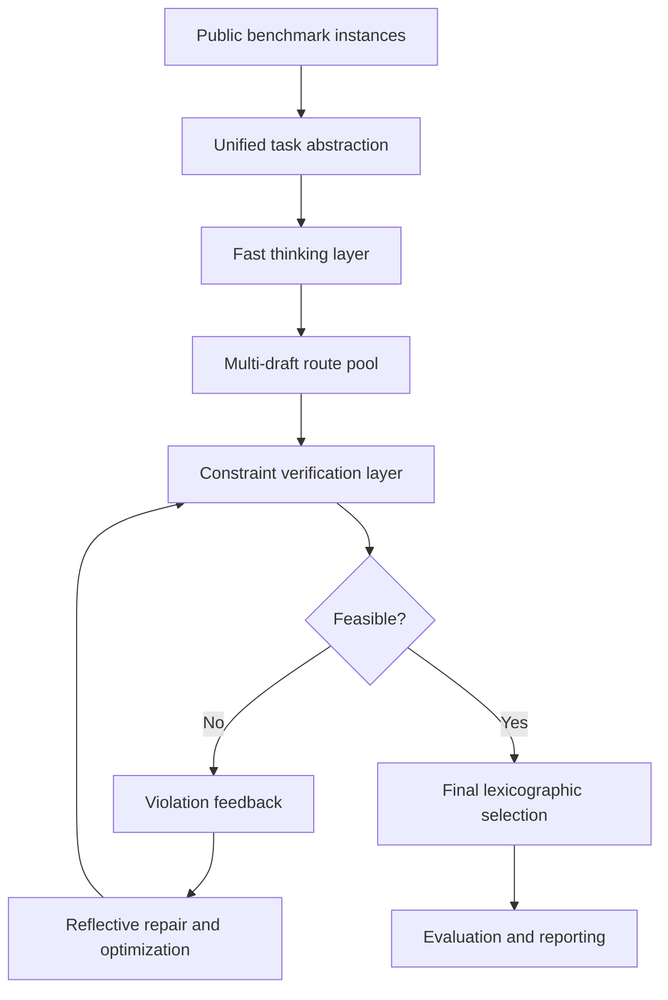
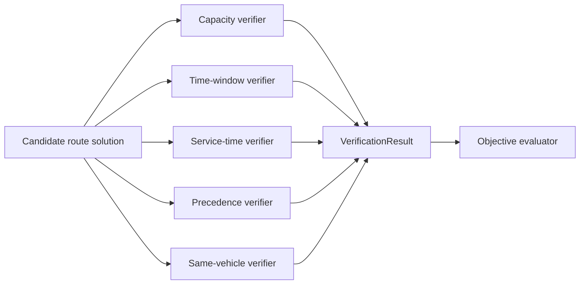
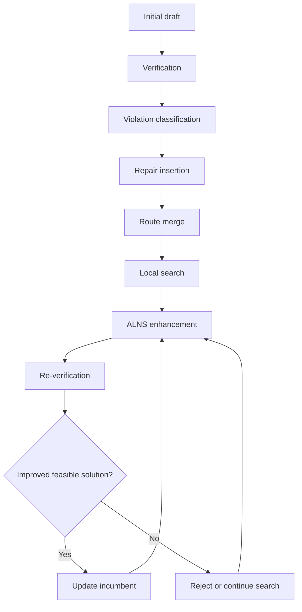

# Mermaid Figures for FTV-Logistics

## Figure 1. Overall FTV-Logistics Framework

```mermaid
flowchart TD
    A["Public benchmark instances"] --> B["Unified task abstraction"]
    B --> C["Fast thinking layer"]
    C --> D["Multi-draft route pool"]
    D --> E["Constraint verification layer"]
    E --> F{"Feasible?"}
    F -- "No" --> G["Violation feedback"]
    G --> H["Reflective repair and optimization"]
    H --> E
    F -- "Yes" --> I["Final lexicographic selection"]
    I --> J["Evaluation and reporting"]
```

## Figure 2. Constraint Verification Layer

```mermaid
flowchart LR
    S["Candidate route solution"] --> C1["Capacity verifier"]
    S --> C2["Time-window verifier"]
    S --> C3["Service-time verifier"]
    S --> C4["Precedence verifier"]
    S --> C5["Same-vehicle verifier"]
    C1 --> R["VerificationResult"]
    C2 --> R
    C3 --> R
    C4 --> R
    C5 --> R
    R --> O["Objective evaluator"]
```

## Figure 3. Reflective Optimization Loop

```mermaid
flowchart TD
    A["Initial draft"] --> B["Verification"]
    B --> C["Violation classification"]
    C --> D["Repair insertion"]
    D --> E["Route merge"]
    E --> F["Local search"]
    F --> G["ALNS enhancement"]
    G --> H["Re-verification"]
    H --> I{"Improved feasible solution?"}
    I -- "Yes" --> J["Update incumbent"]
    I -- "No" --> K["Reject or continue search"]
    J --> G
    K --> G
```
